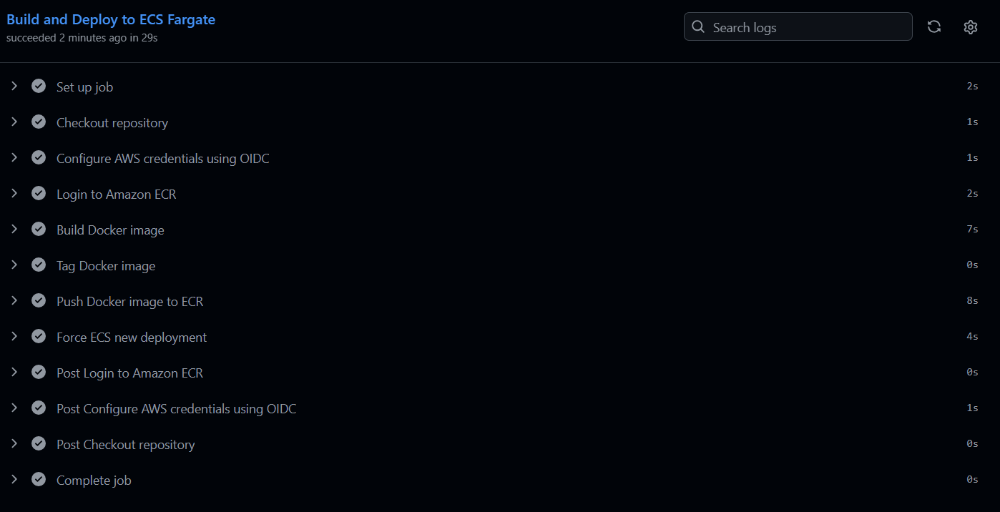

# AWS ECS Fargate Containerised Web App with Terraform and GitHub Actions

## Project Overview

This project demonstrates how to deploy a containerised web application on **AWS ECS Fargate** using **Docker**, **Terraform**, **Amazon ECR**, **Application Load Balancer**, and **GitHub Actions CI/CD**.

The application is a simple Flask web app packaged as a Docker container. The Docker image is stored in Amazon ECR and deployed to ECS Fargate. The infrastructure is provisioned using Terraform, while GitHub Actions automates the build and deployment process.

This project is designed as a cloud engineering and solutions architecture portfolio project to demonstrate containerisation, serverless container hosting, Infrastructure as Code, CI/CD automation, load balancing, and secure AWS authentication using OIDC.

---

## Architecture Overview

```text
User
 |
 v
Application Load Balancer
 |
 v
ECS Fargate Service
 |
 v
Containerised Flask Application
 |
 v
CloudWatch Logs
```

---

## Workflow Overview

```text
Developer
   |
   | Push code to GitHub
   v
GitHub Actions
   |
   |-- Configure AWS credentials using OIDC
   |-- Login to Amazon ECR
   |-- Build Docker image
   |-- Tag Docker image
   |-- Push image to ECR
   |-- Force ECS service deployment
   v
AWS ECS Fargate
   |
   |-- Pulls image from ECR
   |-- Runs updated container task
   |-- Serves traffic through ALB
```

---

## AWS Services Used

- Amazon ECS Fargate
- Amazon ECR
- Application Load Balancer
- Amazon VPC
- Public Subnets
- Internet Gateway
- Route Tables
- Security Groups
- AWS IAM
- AWS STS
- Amazon CloudWatch Logs
- GitHub Actions OIDC
- Terraform

---

## Technologies Used

- AWS
- Terraform
- Docker
- Python Flask
- GitHub Actions
- Amazon ECR
- ECS Fargate
- CloudWatch

---

## Key Features

- Containerised Flask web application
- Serverless container hosting with AWS ECS Fargate
- Docker image stored in Amazon ECR
- Application Load Balancer for public access
- Two public subnets across multiple Availability Zones
- ECS service running multiple Fargate tasks
- CloudWatch logging for container logs
- IAM task execution role
- Security group separation between ALB and ECS tasks
- Infrastructure provisioned using Terraform
- Automated deployment using GitHub Actions
- Secure AWS authentication using OIDC
- No long-term AWS access keys stored in GitHub

---

## Project Structure

```text
aws-ecs-fargate/
│
├── app/
│   ├── app.py
│   ├── requirements.txt
│   └── Dockerfile
│
├── terraform/
│   ├── main.tf
│   ├── variables.tf
│   └── outputs.tf
│
├── .github/
│   └── workflows/
│       └── deploy.yml
│
├── images/
│   └── workflow.png
│
├── README.md
└── .gitignore
```

---

## Application

The application is a simple Python Flask web app.

### Main Endpoint

```text
/
```

Displays a success message confirming that the application is running on AWS ECS Fargate.

### Health Check Endpoint

```text
/health
```

Returns:

```json
{
  "status": "healthy"
}
```

This endpoint is used by the Application Load Balancer target group to check whether the ECS task is healthy.

---

## Infrastructure Deployed

Terraform provisions the following AWS infrastructure:

- VPC
- Two public subnets
- Internet Gateway
- Public route table
- Route table associations
- Application Load Balancer
- ALB target group
- ALB listener
- ECS cluster
- ECS Fargate service
- ECS task definition
- ECR repository
- CloudWatch log group
- IAM task execution role
- ALB security group
- ECS task security group

---

## Security Design

Security is included in the architecture through network controls, IAM roles, and OIDC authentication.

### OIDC Authentication

GitHub Actions uses OpenID Connect to assume an AWS IAM role. This avoids storing permanent AWS access keys in GitHub repository secrets.

### IAM Role

The GitHub Actions workflow assumes an IAM role in AWS to push Docker images to ECR and update the ECS service.

### Security Groups

The Application Load Balancer accepts HTTP traffic from the internet on port `80`.

The ECS task security group only allows inbound traffic from the ALB security group on the application container port.

### ECR Image Scanning

The ECR repository is configured to scan container images on push.

### CloudWatch Logging

Container logs are sent to Amazon CloudWatch Logs for monitoring and troubleshooting.

---

## CI/CD Pipeline

The GitHub Actions workflow is stored in:

```text
.github/workflows/deploy.yml
```

The pipeline runs when code is pushed to the `main` branch and changes are made to the application or workflow files.

### Pipeline Steps

```text
Checkout repository
Configure AWS credentials using OIDC
Login to Amazon ECR
Build Docker image
Tag Docker image
Push Docker image to ECR
Force ECS new deployment
```

---

## Deployment Evidence

The GitHub Actions workflow successfully built the Docker image, pushed it to Amazon ECR, and deployed the application to AWS ECS Fargate.





---

## Prerequisites

Before deploying this project, ensure you have:

- AWS account
- AWS CLI installed and configured
- Terraform installed
- Docker installed
- Git installed
- GitHub repository
- IAM permissions to create ECS, ECR, ALB, VPC, IAM, and CloudWatch resources

---

## How to Deploy Locally

### 1. Clone the Repository

```bash
git clone https://github.com/bpnlc/aws-ecs-fargate.git
cd aws-ecs-fargate
```

### 2. Test the Flask App Locally

```bash
cd app
docker build -t ecs-fargate-demo .
docker run -p 5000:5000 ecs-fargate-demo
```

Open in your browser:

```text
http://localhost:5000
```

Health check:

```text
http://localhost:5000/health
```

---

## Deploy Infrastructure with Terraform

### 1. Go to Terraform Folder

```bash
cd terraform
```

### 2. Initialise Terraform

```bash
terraform init
```

### 3. Format and Validate

```bash
terraform fmt
terraform validate
```

### 4. Preview Infrastructure

```bash
terraform plan
```

### 5. Apply Infrastructure

```bash
terraform apply
```

Type:

```text
yes
```

After Terraform completes, copy the ECR repository URL from the output.

---

## Push Docker Image to Amazon ECR

### 1. Login to ECR

```bash
aws ecr get-login-password --region eu-west-2 | docker login --username AWS --password-stdin 780191826237.dkr.ecr.eu-west-2.amazonaws.com
```

### 2. Build Docker Image

```bash
cd ../app
docker build -t ecs-fargate-demo .
```

### 3. Tag Docker Image

```bash
docker tag ecs-fargate-demo:latest 780191826237.dkr.ecr.eu-west-2.amazonaws.com/ecs-fargate-demo-dev-repo:latest
```

### 4. Push Docker Image

```bash
docker push 780191826237.dkr.ecr.eu-west-2.amazonaws.com/ecs-fargate-demo-dev-repo:latest
```

### 5. Force ECS Deployment

```bash
aws ecs update-service \
  --cluster ecs-fargate-demo-dev-cluster \
  --service ecs-fargate-demo-dev-service \
  --force-new-deployment \
  --region eu-west-2
```

---

## Access the Application

Get the Application Load Balancer DNS name:

```bash
cd ../terraform
terraform output load_balancer_dns_name
```

Open the DNS name in your browser:

```text
http://YOUR-ALB-DNS-NAME
```

Expected result:

```text
AWS ECS Fargate Deployment Successful
```

---

## GitHub Actions Setup

### Required GitHub Secrets

In the GitHub repository, go to:

```text
Settings → Secrets and variables → Actions → New repository secret
```

Add the following secrets:

```text
AWS_ROLE_TO_ASSUME = arn:aws:iam::ACCOUNT_ID:role/github-actions-terraform-role
AWS_ACCOUNT_ID     = ACCOUNT_ID
```

For this project, the AWS account ID used during development was:

```text
780191826237
```

---

## OIDC Trust Policy

The AWS IAM role used by GitHub Actions must trust the GitHub repository.

Example trust policy condition:

```json
"token.actions.githubusercontent.com:sub": "repo:bpnlc/aws-ecs-fargate:*"
```

This allows the GitHub Actions workflow from this repository to assume the AWS IAM role using OIDC.

---

## GitHub Actions Workflow Example

```yaml
name: Deploy ECS Fargate App

on:
  push:
    branches:
      - main
    paths:
      - "app/**"
      - ".github/workflows/deploy.yml"

permissions:
  id-token: write
  contents: read

env:
  AWS_REGION: eu-west-2
  ECR_REPOSITORY: ecs-fargate-demo-dev-repo
  ECS_CLUSTER: ecs-fargate-demo-dev-cluster
  ECS_SERVICE: ecs-fargate-demo-dev-service
  IMAGE_TAG: latest

jobs:
  deploy:
    name: Build and Deploy to ECS Fargate
    runs-on: ubuntu-latest

    steps:
      - name: Checkout repository
        uses: actions/checkout@v4

      - name: Configure AWS credentials using OIDC
        uses: aws-actions/configure-aws-credentials@v4
        with:
          role-to-assume: ${{ secrets.AWS_ROLE_TO_ASSUME }}
          aws-region: ${{ env.AWS_REGION }}

      - name: Login to Amazon ECR
        uses: aws-actions/amazon-ecr-login@v2

      - name: Build Docker image
        run: |
          docker build -t $ECR_REPOSITORY:$IMAGE_TAG ./app

      - name: Tag Docker image
        run: |
          docker tag $ECR_REPOSITORY:$IMAGE_TAG ${{ secrets.AWS_ACCOUNT_ID }}.dkr.ecr.$AWS_REGION.amazonaws.com/$ECR_REPOSITORY:$IMAGE_TAG

      - name: Push Docker image to ECR
        run: |
          docker push ${{ secrets.AWS_ACCOUNT_ID }}.dkr.ecr.$AWS_REGION.amazonaws.com/$ECR_REPOSITORY:$IMAGE_TAG

      - name: Force ECS new deployment
        run: |
          aws ecs update-service \
            --cluster $ECS_CLUSTER \
            --service $ECS_SERVICE \
            --force-new-deployment \
            --region $AWS_REGION
```

---

## Terraform Commands

Useful Terraform commands:

```bash
terraform init
terraform fmt
terraform validate
terraform plan
terraform apply
terraform destroy
```

---

## Docker Commands

Useful Docker commands:

```bash
docker build -t ecs-fargate-demo ./app
docker run -p 5000:5000 ecs-fargate-demo
docker tag ecs-fargate-demo:latest 780191826237.dkr.ecr.eu-west-2.amazonaws.com/ecs-fargate-demo-dev-repo:latest
docker push 780191826237.dkr.ecr.eu-west-2.amazonaws.com/ecs-fargate-demo-dev-repo:latest
```

---

## Architecture Decisions

| Decision        | Reason                                          |
| --------------- | ----------------------------------------------- |
| ECS Fargate     | Runs containers without managing EC2 servers    |
| Docker          | Packages the application with its dependencies  |
| ECR             | Stores Docker images securely in AWS            |
| ALB             | Distributes HTTP traffic to ECS tasks           |
| CloudWatch Logs | Provides visibility into container logs         |
| Terraform       | Defines infrastructure as reusable code         |
| GitHub Actions  | Automates build and deployment                  |
| OIDC            | Avoids storing long-term AWS access keys        |
| Public Subnets  | Simplifies demo deployment and ALB access       |
| Security Groups | Restrict traffic flow between ALB and ECS tasks |

---

## Skills Demonstrated

This project demonstrates:

- AWS container deployment
- Docker image creation
- ECS Fargate service configuration
- ECR image repository management
- Application Load Balancer setup
- VPC networking
- Security group configuration
- CloudWatch logging
- IAM role configuration
- Terraform Infrastructure as Code
- GitHub Actions CI/CD
- OIDC-based AWS authentication
- Automated cloud deployment

---

## Portfolio Value

This project is suitable for demonstrating practical skills for:

- Junior Cloud Engineer
- Junior DevOps Engineer
- AWS Cloud Engineer
- Infrastructure Engineer
- Junior Solutions Architect
- Platform Engineer

It shows the ability to package an application into a container, deploy it to AWS, expose it through a load balancer, and automate deployment using a professional CI/CD pipeline.

---

## Future Improvements

Planned improvements include:

- Add HTTPS using ACM
- Add Route 53 custom domain
- Add private subnets and NAT Gateway
- Add ECS service auto scaling
- Add CloudWatch alarms
- Add blue/green deployment using CodeDeploy
- Add least-privilege IAM policy for GitHub Actions
- Add Terraform remote state backend
- Add image vulnerability scanning gate in CI/CD
- Add production and development environments
- Add automated rollback strategy

---

## Cleanup

To avoid unnecessary AWS costs, destroy the infrastructure when it is no longer needed.

```bash
cd terraform
terraform destroy
```

Type:

```text
yes
```

---

## Author

**Bipin Lamichhane**
